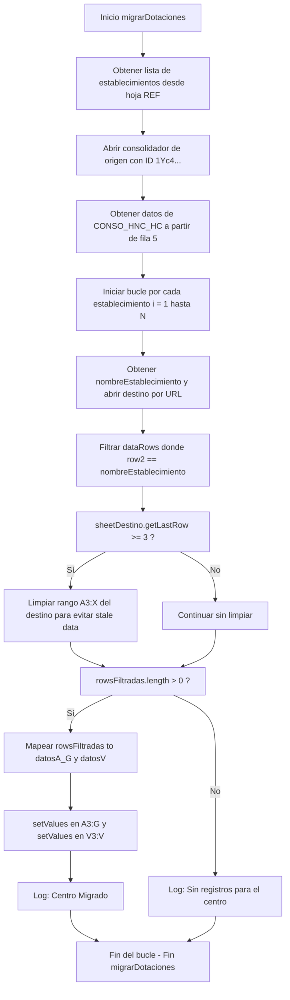

# Especificación de Diseño: Actualización de Dotaciones desde Consolidado Único HNC 2026

**Fecha**: 2026-06-01  
**Estado**: Aprobado por el Usuario  
**Autor**: Antigravity  

---

## 1. Contexto y Objetivos

### Contexto
El proceso periódico de actualización de dotaciones copia los datos del personal de salud de la campaña de **Horas No Clínicas (HNC) 2026** a las planillas de **Programación APS 2026** individuales de cada centro. 

Anteriormente, cada establecimiento poseía su propio archivo individual de HNC (`establecimientos[i][5]`) del cual se leían los datos en bucle. En esta versión, la información de todos los centros se ha unificado en un **único archivo de origen consolidado**.

### Objetivo
Modificar el script [2 - Actualizar dotaciones v3.js](file:///C:/Users/Master/Documents/Proyectos/gas-programacion-2026/src/hnc_2026/scripts/2%20-%20Actualizar%20dotaciones%20v3.js) para:
1. Abrir una única vez el archivo consolidado de HNC de origen.
2. Leer y almacenar temporalmente los registros de todos los funcionarios de salud.
3. Para cada centro (establecimiento), filtrar los registros correspondientes comparando la columna `ESTABLECIMIENTO` con el nombre del centro.
4. Limpiar los registros anteriores en la pestaña `DOTACION` del archivo de destino del centro.
5. Copiar los datos correspondientes en columnas específicas usando un enfoque de escritura masiva (batch) altamente eficiente para evitar límites de ejecución en Google Apps Script.

---

## 2. Definición del Origen de Datos

* **URL del Consolidado de Origen**: `https://docs.google.com/spreadsheets/d/1Yc4t7SmTrXuffMsnr5le1a_V7uoBKmVMnw4WWgzv3Cs/edit?gid=378047231#gid=378047231`
* **ID del Documento**: `1Yc4t7SmTrXuffMsnr5le1a_V7uoBKmVMnw4WWgzv3Cs`
* **Hoja**: `CONSO_HNC_HC`
* **Inicio de Datos**: La fila 4 contiene los encabezados. Los datos reales comienzan a partir de la fila 5 (índice 4 en base 0).

### Estructura de Columnas (Origen)
| Índice | Columna | Descripción |
| :---: | :--- | :--- |
| 0 | ID | Identificador único del funcionario |
| 1 | ADMINISTRACION / COMUNA | Comuna correspondiente |
| 2 | **ESTABLECIMIENTO** | Nombre del centro (usado para filtrar) |
| 3 | **CATEGORIA** | Categoría contractual (ej. CAT_A) |
| 4 | **CARGO** | Cargo del funcionario (ej. CIRUJANO DENTISTA) |
| 5 | **JORNADA** | Carga horaria semanal (horas func) |
| 6 | **FUNCIONARIO** | Nombre completo del funcionario |
| ... | ... | *Columnas intermedias de ausencias y horas no clínicas* |
| 16 | **HORAS CLINICAS (año)** | Horas clínicas anuales asignadas |

---

## 3. Definición del Destino de Datos

* **Hoja**: `DOTACION` dentro del archivo de programación individual de cada centro (`establecimientos[i][3]`).
* **Inicio de pegado**: Los datos deben insertarse a partir de la fila 3.

### Estructura de Columnas (Destino) y Mapeo desde el Origen
El traslado de datos se realiza bajo las siguientes consideraciones de calce:

| Columna Destino | Nombre Columna | Mapeo / Origen | Detalle / Regla de Negocio |
| :---: | :--- | :--- | :--- |
| **A (0)** | ESTAMENTO | Origen Col 4 (`CARGO`) | Traducido mediante la función `traduccionEstamentos()` |
| **B (1)** | CARGO | Origen Col 4 (`CARGO`) | Traducido mediante la función `traduccionEstamentos()` |
| **C (2)** | CAT | Origen Col 3 (`CATEGORIA`) | Copia directa |
| **D (3)** | CALIDAD | Valor Fijo | `"DOTACION"` en todas las filas |
| **E (4)** | NOMBRE FUNCIONARIO/A | Origen Col 6 (`FUNCIONARIO`) | Copia directa |
| **F (5)** | HORAS FUNC | Origen Col 5 (`JORNADA`) | Copia directa |
| **G (6)** | DIAS PROGRAMACION | Valor Fijo | `248` en todas las filas |
| H (7) - U (20) | *Ignoradas* | N/A | No se consideran (se mantendrán vacías o como estén) |
| **V (21)** | TOTAL HORAS CLINICAS AL AÑO | Origen Col 16 (`HORAS CLINICAS (año)`) | Copia directa |
| W (22) - X (23) | *Ignoradas* | N/A | No se consideran |

---

## 4. Diseño del Flujo de Ejecución (Enfoque 1 - Batch)

La ejecución del script modificado seguirá las siguientes fases en Google Apps Script:



---

## 5. Detalles Técnicos de Implementación

### Criterio de Filtrado de Establecimientos
Para evitar fallas por espacios adicionales o discrepancias de mayúsculas/minúsculas entre el listado del consolidador y la base de establecimientos, la comparación será insensible a mayúsculas y libre de espacios laterales:
```javascript
let nombreEstablecimiento = establecimientos[i][0];
let rowsFiltradas = dataRows.filter(row => {
    let estValue = row[2];
    return estValue && estValue.toString().trim().toUpperCase() === nombreEstablecimiento.toString().trim().toUpperCase();
});
```

### Limpieza de Datos Previos
Para evitar dejar registros residuales de sincronizaciones anteriores si el número de funcionarios actuales disminuye, se vaciarán las columnas A a X a partir de la fila 3:
```javascript
let sheetDestino = programacion.getSheetByName("DOTACION");
let lastRow = sheetDestino.getLastRow();
if (lastRow >= 3) {
    sheetDestino.getRange(3, 1, lastRow - 2, 24).clearContent();
}
```

### Escritura Masiva
Los datos mapeados se escribirán en dos llamadas batch:
```javascript
let numRows = rowsFiltradas.length;
if (numRows > 0) {
    // 1. Preparar datosA_G y datosV
    let datosA_G = [];
    let datosV = [];
    let traduccion = traduccionEstamentos();

    for (let r = 0; r < numRows; r++) {
        let sourceRow = rowsFiltradas[r];
        let cargoOriginal = sourceRow[4];
        let cargoTraducido = traduccion[cargoOriginal] ? traduccion[cargoOriginal] : cargoOriginal;

        datosA_G.push([
            cargoTraducido,           // ESTAMENTO (Col A)
            cargoTraducido,           // CARGO (Col B)
            sourceRow[3],             // CAT (Col C)
            "DOTACION",               // CALIDAD (Col D)
            sourceRow[6],             // NOMBRE FUNCIONARIO/A (Col E)
            sourceRow[5],             // HORAS FUNC (Col F)
            248                       // DIAS PROGRAMACION (Col G)
        ]);

        datosV.push([
            sourceRow[16]             // TOTAL HORAS CLINICAS AL AÑO (Col V)
        ]);
    }

    // 2. Ejecutar escrituras masivas
    sheetDestino.getRange(3, 1, numRows, 7).setValues(datosA_G);
    sheetDestino.getRange(3, 22, numRows, 1).setValues(datosV);
}
```

---

## 6. Plan de Pruebas y Validación

1. **Prueba de Extracción Única**: Confirmar que la llamada a `SpreadsheetApp.openById` ocurra exactamente una vez y no genere errores de lectura o cuotas de lectura de Google Drive API.
2. **Prueba de Filtrado**: Verificar en la consola (con `console.log`) que la cantidad de funcionarios filtrados para centros específicos (como `CECOSF CERRO ALEGRE` o `CECOSF ISLA NEGRA`) coincida exactamente con la cantidad de filas que tienen dicho establecimiento en el consolidado físico de origen.
3. **Prueba de Limpieza**: Ejecutar el script sobre una hoja de destino simulada que contenga registros antiguos sobrantes y comprobar que se limpian por completo antes de escribir el nuevo bloque.
4. **Prueba de Pegado Exacto**: Validar que:
   - Las columnas A y B tengan el cargo traducido (por ejemplo, "ODONTOLOGO/A" en lugar de "CIRUJANO DENTISTA").
   - La columna D diga "DOTACION".
   - La columna G diga "248".
   - La columna V reciba las horas clínicas anuales exactas del consolidador.
   - Las columnas intermedias no presenten modificaciones ni sobrescrituras de formato.
